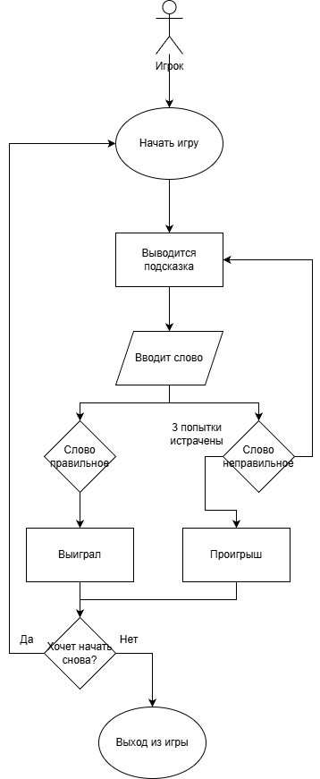

# Игра "Крокодил"
**"Крокодил"** представляет собой однопользовательскую программу, генерирующую рандомные слова, которые игрок должен угадать по ассоциациям. Всего дается 3 попытки. Каждая следующая попытка добавляет новую ассоциацию к слову. Игра заканчивается, когда игрок угадывает загаданное слово, или когда заканчивается количество попыток.

## Какую проблему решает проект?
В классическом "Крокодиле" нужно играть компанией, но часто хочется поиграть одному. Основные проблемы:
1.  Нужна компания. Одному играть скучно, но хочется.
2.  Нужен ведущий. Кто-то должен придумывать слова.
3.  Слова заканчиваются. Быстро надоедает придумывать одно и то же.

Проект решает это просто: программа сама даёт слова, а игрок просто угадывает.

## Целевая аудитория
*   Обычные люди, которым скучно и хочется развлечься.
*   Любители игры "Крокодил", оставшиеся без компании.
*   Все, кто хочет скоротать 5 минут за простой игрой.

## Цели и задачи
Цель проекта: Сделать простую игру для одного игрока, в которой программа генерирует слова, а у игрока есть 3 попытки, чтобы их угадать.

Задачи:
1.  Создать базу слов для генерации.
2.  Реализовать счётчик попыток (3 попытки на игру).
3.  Сделать понятный интерфейс.
4.  Добавить возможность начать игру заново.

## Функционал

### Основные возможности:
1.  Старт игры:
    *   Нажал кнопку "Начать игру" - получил первое слово.
    *   Счётчик показывает 3 попытки.

2.  Геймплей:
    *   На экране крупно отображается ассоциация к слову.
    *   Игрок вводит слово.
    *   Две кнопки управления:
        *   "Угадал" - слово засчитывается, игра заканчивается.
        *   "Не угадал" - попытка сгорает, даётся новое слово.

3.  Конец игры:
    *   Когда попытки закончились (0/3) - игра завершается.
    *   Появляется кнопка "Играть снова", которая обнуляет счётчик и начинает заново.

4.  Интерфейс:
    *   Крупное слово в центре.
    *   Счётчик попыток (например: ❤️❤️💔 - осталось 2 попытки).
    *   Крупные кнопки для удобного нажатия.

## Use Case

